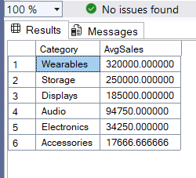

# AxiaStores SQL Database Project

## Project Overview
This project demonstrates a complete SQL based solution for an Electronics & Accessories retail business, **AxiaStores**. It involves designing and implementing a relational database with three core tables, Customer, Product, and Orders. While performing various analytical queries to extract insights.

## Table of Content
- [Project Overview](#project-overview)
- [Objectives](#objectives)
- [Tools and Methodologies](#tools-and-methodologies)
- [Key Analytical Questions](#key-analytical-questions)
- [Samples of SQL Queries and Results](#samples-of-sql-queries-and-results)
- [Answers to Analytical Questions and Results](#answers-to-analytical-questions-and-results)
- [References](#references)

## Objectives
The primary goal of this project is to
- Create a sample relational database
- Creation of multiple tables within the database with appropriate data types and constraints:
- Insertion of sample records into all tables
- Query functions like:
  - Retriever of customer details
  - Sorting alphabetically
  - The use of Join funtion for multiple tables
  - Use of aggregate functions like average and sum
 

## Tools and Methodologies 
**Tool Used:** **SQL SERVER MANAGEMENT STUDIO 21** [Download Here](https://www.microsoft.com/en-us/sql-server/sql-server-downloads)

1. Open your SSMS.
2. Load and execute script like:
   - Create a new database called **AxiaStores**
   - Create **CustomerTB**, **ProductTB**, and **OrdersTB** tables using proper data types and data constraints
   - Populate **CustomerTB**, **ProductTB**, and **OrdersTB** tables with the necessary data
   - Anwser analytical questions and run queries, save and document results for reporting and insights
  

## Key Analytical Questions
The queries in this project aim to answer the following key questions based on the AxiaStores dataset:
1. Return the FirstName and Email of every customer who has ever purchased the product “Wireless Mouse”
2. List all customers’ full names in ascending alphabetical order (LastName, then FirstName)
3. Show every order together with the customer’s full name, the product name, quantity, unit price, total price (quantity × unit price), and order date
4. Show average sales per product category and sort in descending order
5. Which city generated the highest revenue for AxiaStores

## Samples of SQL Queries and Results
Here are examples of key queries used in the project and their results:

1. **CREATING DATABASE**
<pre>
CREATE DATABASE [AxiaStores]; --SQL Server
</pre>

2. **CREATING CustomerTB**
<pre>
CREATE TABLE CustomerTB (
    CustomerID INT PRIMARY KEY,
    FirstName VARCHAR(50),
    LastName VARCHAR(50),
    Email VARCHAR(100),
    Phone VARCHAR(20),
    City VARCHAR(50));

INSERT INTO CustomerTB (CustomerID, FirstName, LastName, Email, Phone, City) VALUES
(1, 'Musa', 'Ahmed', 'musa.ahmed@hotmail.com', '0803-123-0001', 'Lagos'),
(2, 'Ray', 'Samson', 'ray.samson@yahoo.com', '0803-123-0002', 'Ibadan'),
(3, 'Chinedu', 'Okafor', 'chinedu.ok@yahoo.com', '0803-123-0003', 'Enugu'),
(4, 'Dare', 'Adewale', 'dare.ad@hotmail.com', '0803-123-0004', 'Abuja'),
(5, 'Efe', 'Ojo', 'efe.oj@gmail.com', '0803-123-0005', 'Port Harcourt'),
(6, 'Aisha', 'Bello', 'aisha.bello@hotmail.com', '0803-123-0006', 'Kano'),
(7, 'Tunde', 'Salami', 'tunde.salami@yahoo.com', '0803-123-0007', 'Ilorin'),
(8, 'Nneka', 'Umeh', 'nneka.umeh@gmail.com', '0803-123-0008', 'Owerri'),
(9, 'Kelvin', 'Peters', 'kelvin.peters@hotmail.com', '0803-123-0009', 'Asaba'),
(10, 'Blessing', 'Mark', 'blessing.mark@gmail.com', '0803-123-0010', 'Uyo');
</pre>

## Answers to Analytical Questions and Results

1. **Return the FirstName and Email of every customer who has ever purchased the product “Wireless Mouse”**
<pre>
-- Return FirstName and Email of customers who purchased “Wireless Mouse”
SELECT C.FirstName, C.Email
FROM CustomerTB C
JOIN OrderTB O ON C.CustomerID = O.CustomerID
JOIN ProductsTB P ON O.ProductID = P.ProductID
WHERE P.ProductName = 'Wireless Mouse';
</pre>

2. **List all customers’ full names in ascending alphabetical order (LastName, then FirstName)**
<pre>
-- List all customers full names in ascending alphabetical order (LastName then FirstName)
SELECT LastName + ' ' + FirstName AS FullName
FROM CustomerTB
ORDER BY LastName ASC, FirstName ASC;
</pre>

3. **Show every order together with the customer’s full name, the product name, quantity, unit price, total price (quantity × unit price), and order date.**
<pre>
-- Show every order with full name, product name, quantity, unit price, total price, and order date
SELECT 
    C.FirstName + ' ' + C.LastName AS FullName,
    P.ProductName,
    O.Quantity,
    P.UnitPrice,
    (O.Quantity * P.UnitPrice) AS TotalPrice,
    O.OrderDate
FROM OrderTB O
JOIN CustomerTB C ON O.CustomerID = C.CustomerID
JOIN ProductsTB P ON O.ProductID = P.ProductID;
</pre>

4. **Show average sales per product category and sort in descending order**
<pre>
-- Show average sales per product category and sort in descending order
SELECT 
    P.Category,
    AVG(O.Quantity * P.UnitPrice) AS AvgSales
FROM OrderTB O
JOIN ProductsTB P ON O.ProductID = P.ProductID
GROUP BY P.Category
ORDER BY AvgSales DESC;
</pre>

5. **Which city generated the highest revenue for AxiaStores?**
<pre>
-- Which city generated the highest revenue?
SELECT TOP 1
    C.City,
    SUM(O.Quantity * P.UnitPrice) AS TotalRevenue
FROM OrderTB O
JOIN CustomerTB C ON O.CustomerID = C.CustomerID
JOIN ProductsTB P ON O.ProductID = P.ProductID
GROUP BY C.City
ORDER BY TotalRevenue DESC;
</pre>

### References
- [Axia Africa SQL Exam](https://drive.google.com/file/d/13chnDFUr7NqbyPSRqy65d9pgeVCM86Ix/view)
- [Axia Africa](https://student.axia.africa)
